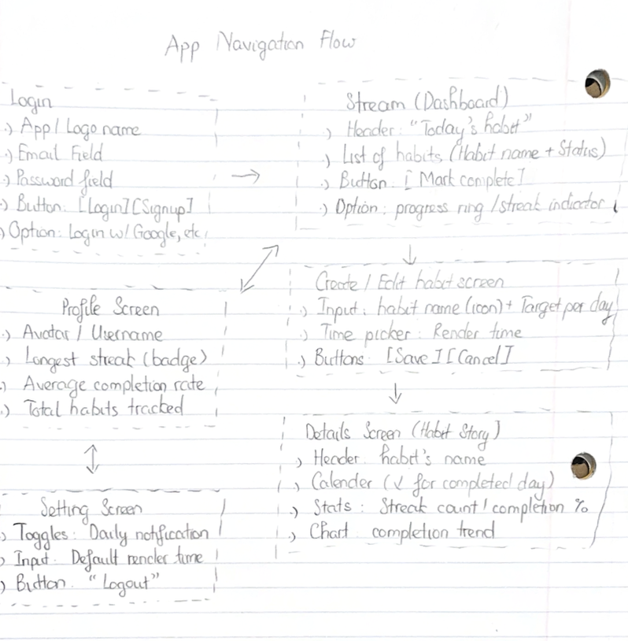
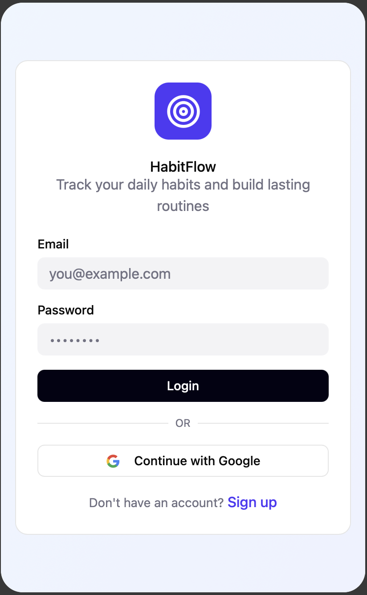
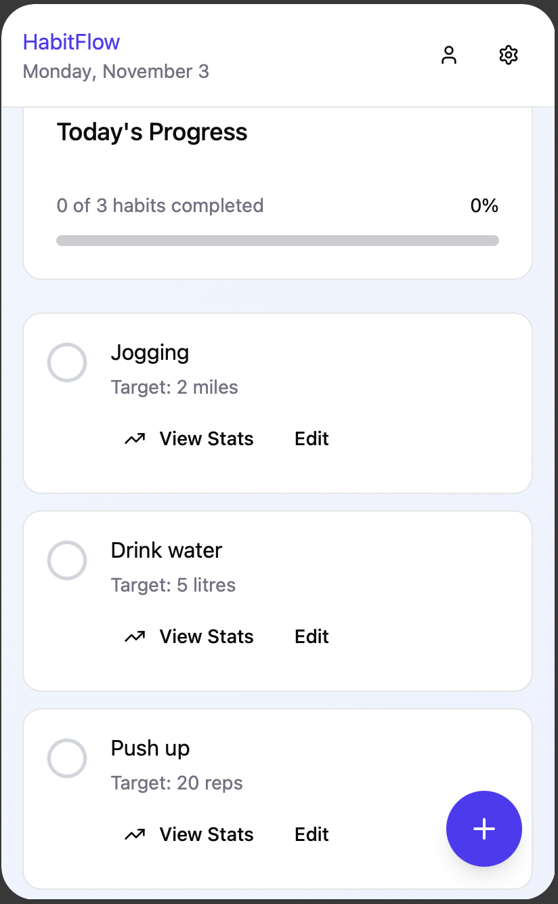
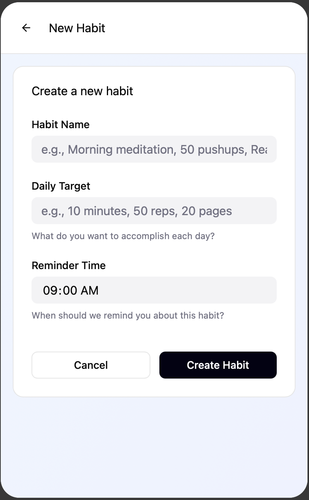
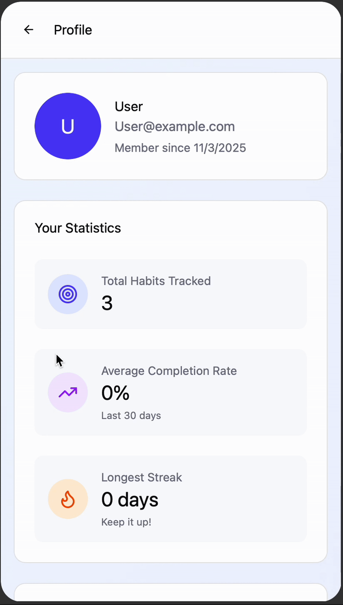

# Milestone 1 - **Micro-Habit Coach** (Unit 7)

## Table of Contents

* [Overview](#overview)
  * [Description](#description)
  * [App Evaluation](#app-evaluation)
* [Product Spec](#product-spec)
  * [1. User Features (Required and Optional)](#1-user-features-required-and-optional)
  * [2. Screen Archetypes](#2-screen-archetypes)
  * [3. Navigation](#3-navigation)
* [Wireframes](#wireframes)

---

## Overview

### Description

Ultra-low-friction habit app with **Android-native intelligence**. Users create habits (unlimited, sane defaults shown). The app uses **Activity Recognition** (movement), **Geofencing** (place-based nudges), and **dynamic notifications** (streak-loss countdown) so tasks happen at the **right time and place**, not just at 9:00 PM. One tap to complete; streaks and history keep you honest.

This application is designed to simplify behavioral change by using intelligent triggers that adapt to the user’s daily routine. Unlike traditional habit trackers that rely exclusively on fixed time reminders, Micro-Habit Coach leverages contextual data such as motion, location, and activity type. Its goal is to create an ecosystem where building small habits becomes automatic and sustainable. The app prioritizes responsiveness, minimal interaction cost, and gentle reinforcement through real-time streak tracking and context-based encouragement.

The user interface focuses on clarity and immediacy: every action is one tap away, and notifications are carefully timed to motivate rather than distract. The result is a habit system that feels native to daily life, blending seamlessly with existing routines.

### App Evaluation

**Category:** Productivity / Health & Fitness  
**Mobile:** Very high. Core functionality depends on mobile-native APIs, including **Activity Recognition**, **Geofencing**, and **WorkManager** for background tasks. Optional support for **AppWidgets** allows rapid habit completion from the home screen.  
**Story:** “It nags you cleverly until you actually do the thing.” Demo highlights adaptive notifications that change based on user context, showcasing motion detection, geofence activation, and streak countdown alerts.  
**Market:** Broad demographic including students, professionals, and athletes who want structured habit reinforcement without excessive manual tracking.  
**Habit:** Built for daily engagement. Positive reinforcement (streaks, progress analytics) and negative reinforcement (streak-loss countdown) create habitual use. The app encourages consistency through real-world triggers like movement or arrival at a familiar location.  
**Scope:** MVP maintains a concise and achievable focus while demonstrating the full range of Android-native capabilities. Key systems include Room database persistence, WorkManager scheduling, background geofence triggers, and in-app data visualization. Additional features such as widgets or cloud sync can be introduced without altering core logic.

---

## Product Spec

### 1. User Features (Required and Optional)

#### Required Features (MVP)

* **Account & Onboarding**

  * Create account; choose from **smart templates** (e.g., *Hydrate at Gym*, *Move Break*, *Walk 10 min*, *Read 10 pages*) or create a custom habit.
  * No hard limit on habits; **soft guidance** to 3–6 for clarity (UI stays performant).
  * The onboarding process guides users through permission setup for motion and location. It also introduces the app’s core features and explains how automated completion works.
  * User data and settings are stored locally via Room for speed and privacy, with future compatibility for cloud sync.
  * Contextual setup ensures habits are intelligently categorized (time, movement, or location), reducing user confusion during initial configuration.

* **Today (Mark Complete)**

  * Displays all habits scheduled or active for the current day, grouped by completion state.
  * Each habit tile shows its progress bar, time of next reminder, and streak count.
  * Users can complete any habit with a single tap, triggering immediate visual feedback such as confetti or color transitions.
  * Automatic updates ensure accurate reflection of sensor-triggered completions without refreshing the page.

* **Scheduled & Dynamic Notifications**

  * **Time-based** reminders use WorkManager for reliable background execution, even in doze mode.
  * Dynamic notifications provide streak-saving alerts (“You have 2 hours to save your streak”) and adapt based on user behavior or inactivity.
  * Each reminder can trigger actionable buttons (e.g., “Mark Done” or “Snooze”) to minimize app entry friction.
  * Duplicate or redundant notifications are automatically filtered to maintain a clean user experience.

* **Activity Recognition Assist (base)**

  * Integrates Android’s ActivityRecognitionClient to detect transitions such as walking, running, or being stationary.
  * Movement-type habits like *Walk 10 min* or *Move Break* can be automatically marked complete once motion duration or intensity meets the threshold.
  * Sensor sampling is optimized to conserve battery by reducing polling intervals when inactive.
  * Logs each recognized activity event for analytics and future machine learning recommendations.

* **Geofenced Nudges (base)**

  * Implements FusedLocationProviderClient for low-power geofencing.
  * Place-based habits such as *Hydrate at Gym* or *Stretch at Home* activate a notification when the user enters a predefined location radius.
  * Users can define radius sensitivity to minimize false triggers.
  * Permission fallback gracefully disables this feature and reverts to time-based reminders with clear in-app messaging.

* **Habit Detail & History**

  * Provides detailed streak tracking, performance summaries, and trend visualization.
  * Calendar and list modes offer both high-level and granular views of progress.
  * Each completion entry is logged in Room and rendered dynamically through LiveData for instant updates.
  * History analytics display seven-day and thirty-day completion percentages, helping users monitor adherence and growth.

* **Create/Edit/Delete Habit**

  * Users can create new habits or edit existing ones with a guided form interface that adapts to habit type.
  * Options include naming, target count, time scheduling, and optional motion or location triggers.
  * Smart validation prevents setting conflicting reminders and limits excessive notification frequency.
  * Deleting a habit removes its associated triggers, database entries, and notification schedules cleanly.

* **Settings**

  * Users can toggle notifications, configure Quiet Hours, manage permissions, and enable battery optimization.
  * Includes access to a “Data Management” section where users can clear history or reset streaks.
  * Battery-friendly mode automatically adjusts sensor update intervals and background job frequency.
  * Provides direct navigation to Android’s system settings for location or motion permissions.

#### Optional Features (Stretch)

* **Home-Screen Widget**

  * Displays remaining habits for the day with completion shortcuts.
  * Widget updates dynamically as habits are completed or auto-marked through sensors.

* **Lite Social Accountability**

  * Allows users to share habit streaks or completion milestones with friends for external motivation.
  * Designed as a read-only sharing mode to maintain privacy and simplicity.

* **Cloud Backup/Sync**

  * Optional Firebase integration for cross-device data storage.
  * Synchronizes habit configurations, completion history, and streaks to maintain continuity when reinstalling or switching devices.

* **Multi-place Geofences & Advanced Rules**

  * Allows linking multiple geofences to one habit (e.g., “Any Gym” or “Home or Park”).
  * Users can apply frequency conditions such as “only trigger once every 6 hours.”
  * Adds scheduling hierarchy for smarter trigger prioritization.

---

### 2. Screen Archetypes

* **Login / Onboarding**

  * Users authenticate through email or Google Sign-In.
  * Smart templates displayed as visual cards to help first-time users select practical examples quickly.
  * Permissions for motion and location are requested contextually with justifications for each use.
  * Includes micro-animations and clear progress indicators to maintain engagement during setup.

* **Today (Stream)**

  * Displays an adaptive list of active habits prioritized by urgency and streak risk.
  * Uses color-coded progress rings and completion toggles for quick scanning.
  * A summary banner at the top shows total habits completed and time remaining to preserve streaks.
  * Background service continuously updates this list based on motion and geofence triggers.

* **Add / Edit Habit (Creation)**

  * Includes type selector: *Time-based*, *Movement-based*, or *Location-based*.
  * Dynamic forms automatically expand or hide fields based on habit type.
  * Built-in data validation ensures that entered times, motion thresholds, and locations are realistic.
  * Each habit preview updates in real time to show how it will appear on the Today screen.

* **Habit Detail**

  * Displays a detailed breakdown of streak length, best streak, completion percentage, and trend over time.
  * Users can toggle between list and calendar history views.
  * Edit and delete options remain accessible at the top for immediate changes.
  * Designed for responsive performance even with extensive historical data.

* **Profile / Stats**

  * Summarizes user performance through aggregate statistics.
  * Highlights longest streak, completion rate, and consistency metrics.
  * Provides motivational insights such as “Most Consistent Habit” and “Best Day of the Week.”
  * Built using chart components for visual feedback on habit adherence.

* **Settings**

  * Consolidates global preferences, notifications, permissions, and backup options.
  * Quiet Hours configuration uses sliders for intuitive selection.
  * Visual permission status indicators (granted, denied, pending) improve transparency.
  * Includes system shortcuts for motion and location permission management.

---

### 3. Navigation

#### Tab Navigation (Tab to Screen)

* **Today**
* **Add** (or FAB if using 3 tabs)
* **Stats**
* **Settings** *(can live under Stats overflow if 3 tabs)*

#### Flow Navigation (Screen to Screen)

* **Login/Onboarding → Today**  
  Directs new users to their first-day dashboard after initial setup.  
* **Today → Habit Detail**  
  Opens detailed progress view of a selected habit.  
* **Today → Add/Edit Habit**  
  Launches creation flow; returning automatically updates the Today list.  
* **Habit Detail → Edit Habit**  
  Preserves data context for immediate modifications.  
* **Stats → Habit Detail**  
  Enables users to explore analytics behind any habit summary metric.  
* **Settings → System permission screens** (Notifications/Activity/Location)  
  Opens Android system dialogs for adjusting key permissions when needed.

Navigation emphasizes logical flow with minimal friction. Transitions between screens use smooth animations to maintain focus and continuity. The design prioritizes clarity, ensuring that users always understand where they are and how to return to the main dashboard.

---

## Wireframes

* **Onboarding**  
  Introduces templates, permission requests, and contextual guidance for first-time setup.  
  

* **Today (list + big “Mark Done”)**  
  Central dashboard displaying all active habits and real-time progress.  
  

* **Add/Edit (type selector → dynamic form)**  
  Context-sensitive form layout adjusting dynamically to chosen habit type.  
  

* **Habit Detail (streak + history)**  
  Data visualization of performance trends with quick edit access.  
  

* **Stats (completion %, longest streak)**  
  Presents user analytics using charts and summaries.  
  

* **Settings (quiet hours, permissions)**  
  Displays notification control, Quiet Hours scheduling, and permission overview.  
  

**Demo walkthrough**  
Demonstrates complete user flow: onboarding, creating a habit, triggering via motion/location, marking completion, and viewing analytics.  

---

Milestone 2 - Build Sprint 1 (Unit 8)
GitHub Project board
[Add screenshot of your Project Board with three milestones visible in this section] 

Issue cards

Issues worked on this sprint

[Add giphy that shows current build progress for Milestone 2. Note: We will be looking for progression of work between Milestone 2 and 3. Make sure your giphys are not duplicated and clearly show the change from Sprint 1 to 2.]

